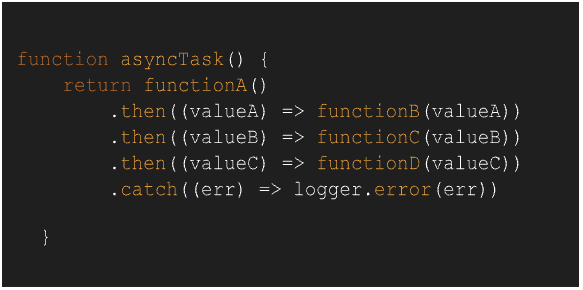

# PT-Transnovasi-Bangun-Persada-Test

1. Apa itu “Event Emmitter”?
   dan tuliskan contoh code nya.

```
EventEmitter dalam JavaScript adalah objek yang memungkinkan komunikasi antara komponen yang berbeda dalam aplikasi. Ini adalah bagian dari pola desain pemrograman yang dikenal sebagai Observer atau Pub-Sub (Publisher-Subscriber). EventEmitter memungkinkan komponen untuk mengirim dan menerima peristiwa (event) dan memberikan mekanisme untuk menghubungkan dan memisahkan komponen-komponen tersebut.

Dalam Node.js, EventEmitter adalah bagian dari modul inti dan juga tersedia melalui pustaka JavaScript yang terpisah seperti EventEmitter2 atau EventEmitter3. Di lingkungan browser, tidak ada EventEmitter bawaan, tetapi beberapa pustaka pihak ketiga, seperti RxJS atau EventEmitter.js, menyediakan implementasi EventEmitter yang serupa.

EventEmitter memiliki dua fungsi utama: emit (menghasilkan peristiwa) dan on (mendengarkan peristiwa). Ketika EventEmitter menghasilkan peristiwa, komponen lain yang "mendengarkan" peristiwa tersebut dapat menanggapi dan menjalankan kode yang sesuai dengan peristiwa tersebut. Dalam hal ini, EventEmitter bertindak sebagai penerbit (publisher) yang mengirim peristiwa, sedangkan komponen lain bertindak sebagai pelanggan (subscriber) yang mendengarkan peristiwa.

Dengan EventEmitter, Anda dapat membuat komunikasi yang terstruktur antara berbagai komponen dalam aplikasi JavaScript Anda, dan memberikan cara yang fleksibel untuk berbagi data dan menjalankan kode berdasarkan peristiwa yang terjadi.

nots: sumber by google
```

```js
// 1. Apa itu “Event Emmitter”? dan tuliskan contoh code nya.
// jawaban no 1 "Apa itu “Event Emmitter”? dan tuliskan contoh code nya."
const EventEmitter = require("events");

// Membuat instance EventEmitter
const myEmitter = new EventEmitter();

myEmitter.on("greeting", (name) => {
  console.log(`Hello, ${name}!`);
});

myEmitter.on("sapa", (name) => {
  console.log(`Hello, ${name}!`);
});

// sama seperti switch case tp EventEmitter
// dan like a function yang mempunyai alamat sendiri agar jelas di panggil yang mana
// tidak terlalu mirip tapi dari konsep hampir tp harus di bikin ulang logicnya
const callMe = (key, name) => {
  switch (key) {
    case "sapa":
      console.log(`Hello, ${name}!, << from switch`);
      break;
    case "greeting":
      console.log(`Hello, ${name}!, << from switch`);
      break;
    default:
      break;
  }
};

// memanggil event "greeting" and "sapa"
myEmitter.emit("greeting", "John");
myEmitter.emit("sapa", "naim");
callMe("sapa", "naim");
```

2. Tulis ulang promise-based Node.js ke async/await.
   Code:
   

```js
// 2. Tulis ulang promise-based Node.js ke async/await. Code:

function functionA() {
  return new Promise((resolve, _) => {
    resolve("hello world");
  });
}
function functionB(value) {
  return value + " -From B";
}
function functionC(value) {
  return value + " -From C";
}
function functionD(value) {
  return value + " -From D";
}
function asyncTask1() {
  return functionA()
    .then((valueA) => functionB(valueA))
    .then((valueB) => functionC(valueB))
    .then((valueC) => functionD(valueC))
    .then((result) => console.log(result, "< 1"))
    .catch((err) => {
      logger.error(err);
    });
}

async function asyncTask2() {
  try {
    const valueA = await functionA();
    const valueB = await functionB(valueA);
    const valueC = await functionC(valueB);
    const result = await functionD(valueC);
    console.log(result, "< 2");
  } catch (err) {
    logger.error(err);
  }
}

asyncTask1();
asyncTask2();
```

3. Jelaskan beberapa pendekatan Error Handling di Node.js yang Anda ketahui. Yang mana yang akan Anda gunakan?
   \*berikan contoh code nya:

- Menggunakan callback: Pendekatan ini adalah yang paling umum sebelum async/await

```js
function asynchronousOperation(callback) {
  // Lakukan operasi asynchronous
  // Jika berhasil, panggil callback(null, hasil)
  // Jika terjadi kesalahan, panggil callback(error)
}

asynchronousOperation(function (error, result) {
  if (error) {
    // Tangani kesalahan
  } else {
    // Gunakan hasil
  }
});
```

- Menggunakan try/catch dengan throw pada fungsi synchronous

```js
function synchronousFunction() {
  // Lakukan operasi synchronous
  // Jika terjadi kesalahan, lemparkan kesalahan
}

try {
  synchronousFunction();
} catch (error) {
  // Tangani kesalahan
}

async function asynchronousFunction() {
  try {
    // Lakukan operasi asynchronous
  } catch (error) {
    // Tangani kesalahan
  }
}

asynchronousFunction();
```

- contoh

```js
function divide(a, b) {
  if (b === 0) {
    throw new Error("Divide by zero error");
  }
  return a / b;
}

try {
  const result = divide(10, 0);
  console.log(result);
} catch (error) {
  console.error("Error:", error.message);
}
```
